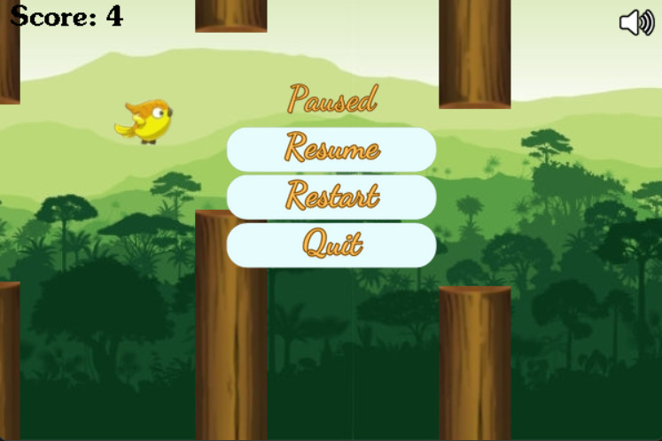
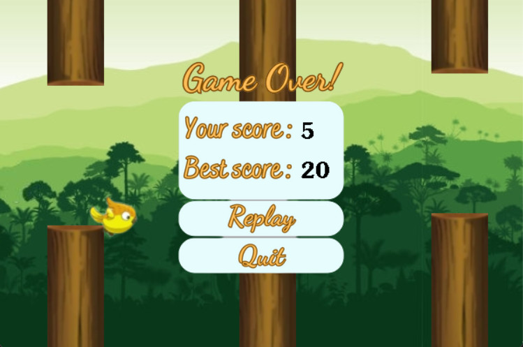

# Flappy Bird Game

---

### ***Introduce myself***
Full name: Nguyen Khanh Linh - 22021158

Class K67CC - University of Engineering and Technology

# ***Welcome to my game!***
---

The game was developed based on the classic Flappy Bird game but has been augmented with additional features, graphics and sounds to make it more lively.

The game is written in C++ using the SDL2.0 graphics library and programmed on Visual Studio Code.

## ***Programming language and Technology***
- Language: C++
- Graphics library SDL2.0
- IDE: Visual Studio Code (or any another IDE that supports C++)

## ***Setting***
- Step 1: Download the game source code from the official GitHub repository.
- Step 2: Unzip the ZIP file.
- Step 3: Locate the main.exe file and open it to start playing the game.

If your screen displays the message ***Windows protected your PC***, please click on ***More info*** and then click on ***Run anyway***. 

## ***Description***
***Let's assume you are living in a world without the Flappy Bird game :))***

### ***Start Screen***
Players will start the game with three options: ***start***, ***quit*** or ***how to play*** (to view game instructions).

### ***Gameplay***
- The game has been improved from the previous version, with columns that move unexpectedly and you cannot predict it beforehand. Players use the `SPACE` key or the `UP` key or ***click the mouse*** to control the bird to fly over the columns on the flight path. Your mission is to control the bird to avoid colliding with the columns or the game screen and collect points. When the bird flies over a column, you will get 1 point added.

- You can pause the game while playing by pressing the `Esc` key, where you have options: adjust the sound, ***resume***, ***restart*** or ***quit***.

- When the game ends, the screen will display your score and the best score ever updated. Here you can choose to ***replay*** or ***quit***.

## ***Programming Techniques***
- Struct and Class
- Vector
- Reading and writing Files
- Separating Files by Objects
- Graphics

## ***References***
- Reference code at https://lazyfoo.net/tutorials/SDL/ and https://www.youtube.com/.
- Image editing software at https://www.canva.com/ and https://www.remove.bg/.
- Many images and sounds are taken from different sources at https://www.google.com/?hl=vi.

## ***Postscript***
I would like express my gratitude to:
- Mr. Tran Quoc Long, Mr. Ta Viet Cuong
- Mr. Le Bang Giang
- My lovely classmates in K67CC

for their help in completing this task.

## ***Contribution***
If you have any contributions to the game or encounter difficulties while playing the game, please create a Pull request or report a new issue. Thank you very much for your interest in the game, and I wish you have enjoyable moments with this game.

---
---
